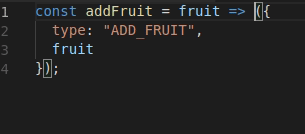

# Debugging arrow functions

Arrow functions are ubiquitous in React and Redux. Here's an example from [yesterday's readings][actions] on action creators:

```js
const addFruit = fruit => ({
  type: "ADD_FRUIT",
  fruit
});
```

As it stands, `addFruit` is difficult to debug. Suppose we want to inspect the value of `fruit`. We **can't** do this:


```js
const addFruit = fruit => ({
  debugger
  type: "ADD_FRUIT",
  fruit
});
```

`{ type: "ADD_FRUIT",  fruit }` is an object, and we can't put debuggers inside of object. But we also **can't** do this:


```js
const addFruit = fruit => (
  debugger
  {
    type: "ADD_FRUIT",
    fruit
  }
);
```

As seen in the `clearFunction` example in [the reading on arrow functions][arrow-function], parentheses can be used to implicitly return objects in ES6. As a result, the above won't work, because we can't put a debugger inside of return statement.

Instead, in order to put a debugger inside of `addFruit`, we first need to convert it into a function with an explicit return statement:

```js
const addFruit = fruit => {
  return {
    type: "ADD_FRUIT",
    fruit
  };
};
```

Now, finally, we can put the debugger before we return:


```js
const addFruit = fruit => {
  debugger
  return {
    type: "ADD_FRUIT",
    fruit
  };
};
```

Here's the whole thing once more as a gif:



If you want to avoid havign to do this over and over again as you're debugging your arrow functions, you can make it a habit to write all of your arrow functions with explicit return statements.

[actions]: actions.md
[arrow-functions]: ../../javascript/readings/fat-arrows.md#syntactic-ambiguity